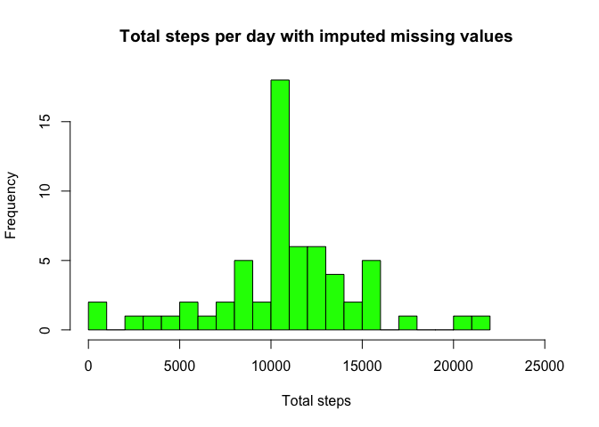

# Reproducible Research: Peer Assessment 1

## About
The purpose of this assignment was to answer a series of questions using data collected from a FitBit. The device collects data at 5 minute intervals through out the day. The data consists of two months of data from an anonymous individual collected during the months of October and November, 2012 and include the number of steps taken in 5 minute intervals each day.

The variables included in this dataset are:
- steps: Number of steps taking in a 5-minute interval (missing values are coded as 𝙽𝙰)
- date: The date on which the measurement was taken in YYYY-MM-DD format
- interval: Identifier for the 5-minute interval in which measurement was taken

The dataset is stored in a comma-separated-value (CSV) file and there are a total of 17,568 observations in this dataset.


## Loading and preprocessing the data

```r
activity <- read.csv("activity.csv")
```


## What is mean total number of steps taken per day?

##### Step 1. Calculate total number of steps per day

```r
library(dplyr)
```

```
## 
## Attaching package: 'dplyr'
```

```
## The following objects are masked from 'package:stats':
## 
##     filter, lag
```

```
## The following objects are masked from 'package:base':
## 
##     intersect, setdiff, setequal, union
```

```r
total_steps <- activity %>%
        group_by(date) %>%
        filter(!is.na(steps)) %>%
        summarize(steps = sum(steps,na.rm=T))
```

##### Step 2. Make a histogram of the total number of steps taken each day

```r
hist(total_steps$steps, breaks=25, xlim=c(0, 25000), col = "green", xlab = "Total steps", ylab = "Frequency", main = "Total number of steps per day")
```

<!-- -->

##### Step 3. Calculate and report the mean and median of the total number of steps taken per day

```r
mean_steps <- mean(total_steps$steps, na.rm=T)
mean_steps
```

```
## [1] 10766.19
```

```r
median_steps <- median(total_steps$steps, na.rm=T)
median_steps
```

```
## [1] 10765
```


## What is the average daily activity pattern?

```r
daily_act <- activity %>%
        group_by(interval) %>%
        filter(!is.na(steps)) %>%
        summarize(ave_steps = mean(steps,na.rm=T))
```

##### Step 1. Make a time series plot of the 5-minute interval (x-axis) and the average number of steps taken, averaged across all days (y-axis)

```r
plot(daily_act$interval, daily_act$ave_steps, col="green", type = "l", lwd = 2, xlab="5min Interval", ylab = "Average number steps")
```

<!-- -->

##### Step 2. Which 5-minute interval, on average across all the days in the dataset, contains the maximum number of steps?

```r
max_int <- daily_act[which.max(daily_act$ave_steps),]
max_int
```

```
## # A tibble: 1 × 2
##   interval ave_steps
##      <int>     <dbl>
## 1      835  206.1698
```


## Imputing missing values
A number of days/intervals are missing from the dataset and are coded as NA. The presence of missing days may introduce bias into some calculations or summaries of the data.

##### Step 1. Calculate and report the total number of missing values in the dataset (i.e. the total number of rows with 𝙽𝙰s)
total_na <- sum(is.na(activity$steps))
total_na

##### Step 2. Devise a strategy for filling in all of the missing values in the dataset. 
Will use the mean for the 5-minute interval where data is missing.

##### Step 3.  Create a new dataset that is equal to the original dataset but with the missing data filled in.

```r
activity2 <- activity %>%
        group_by(interval) %>%
        mutate(imp_steps = replace(steps, is.na(steps), mean(steps,na.rm=T)))
```

##### Step 4. Make a histogram of the total number of steps taken each day. 

```r
total_imp_steps <- activity2 %>%
        group_by(date) %>%
        summarize(steps = sum(imp_steps,na.rm=T))
total_imp_steps
```

```
## # A tibble: 61 × 2
##          date    steps
##        <fctr>    <dbl>
## 1  2012-10-01 10766.19
## 2  2012-10-02   126.00
## 3  2012-10-03 11352.00
## 4  2012-10-04 12116.00
## 5  2012-10-05 13294.00
## 6  2012-10-06 15420.00
## 7  2012-10-07 11015.00
## 8  2012-10-08 10766.19
## 9  2012-10-09 12811.00
## 10 2012-10-10  9900.00
## # ... with 51 more rows
```

```r
hist(total_imp_steps$steps, breaks=25, xlim=c(0, 25000), col = "green", xlab = "Total steps", ylab = "Frequency", main = "Total steps per day with imputed missing values")
```

<!-- -->

##### Step 5. Calculate and report the mean and median total number of steps taken per day. Do these values differ from the estimates from the first part of the assignment? 

```r
mean_imp_steps <- mean(total_imp_steps$steps, na.rm=T)
mean_imp_steps
```

```
## [1] 10766.19
```

```r
median_imp_steps <- median(total_imp_steps$steps, na.rm=T)
median_imp_steps
```

```
## [1] 10766.19
```

##### Step 6. Impact of imputing missing data

```r
summary(total_steps)
```

```
##          date        steps      
##  2012-10-02: 1   Min.   :   41  
##  2012-10-03: 1   1st Qu.: 8841  
##  2012-10-04: 1   Median :10765  
##  2012-10-05: 1   Mean   :10766  
##  2012-10-06: 1   3rd Qu.:13294  
##  2012-10-07: 1   Max.   :21194  
##  (Other)   :47
```

```r
summary(total_imp_steps)
```

```
##          date        steps      
##  2012-10-01: 1   Min.   :   41  
##  2012-10-02: 1   1st Qu.: 9819  
##  2012-10-03: 1   Median :10766  
##  2012-10-04: 1   Mean   :10766  
##  2012-10-05: 1   3rd Qu.:12811  
##  2012-10-06: 1   Max.   :21194  
##  (Other)   :55
```

Mean and median values are almost the same, but the quantiles are significantly different.


## Are there differences in activity patterns between weekdays and weekends?
For this part the 𝚠𝚎𝚎𝚔𝚍𝚊𝚢𝚜() function may be of some help here. Use the dataset with the filled-in missing values for this part.

##### Step 1. Create a new factor variable in the dataset with two levels – “weekday” and “weekend” indicating whether a given date is a weekday or weekend day.

```r
activity2$date <- as.Date(activity2$date)

activity2$day_type = ifelse(weekdays(activity2$date)=="Saturday" | weekdays(activity2$date)=="Sunday", "Weekend", "Weekday")
```

##### Step 2. Make a panel plot containing a time series plot of the 5-minute interval (x-axis) and the average number of steps taken, averaged across all weekday days or weekend days (y-axis)

```r
Interval<- activity2 %>%
        group_by(interval, day_type) %>%
        summarise(avg_steps = mean(imp_steps, na.rm=TRUE))

Interval$day_type <- as.factor(Interval$day_type)

library(lattice)
xyplot(avg_steps ~ interval | day_type, data = Interval, type = "l", col = "green", layout = c(1,2))
```

<!-- -->

During the weekday the test object is more active earlier in the day while during the weekend activity is spread out thoughout the day. Probably test object exercises before work during the weekdays.
